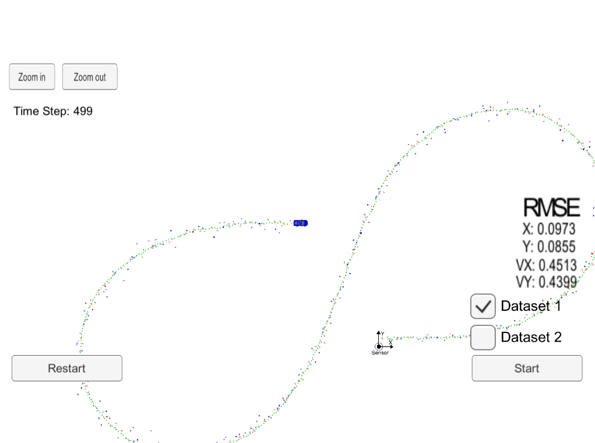
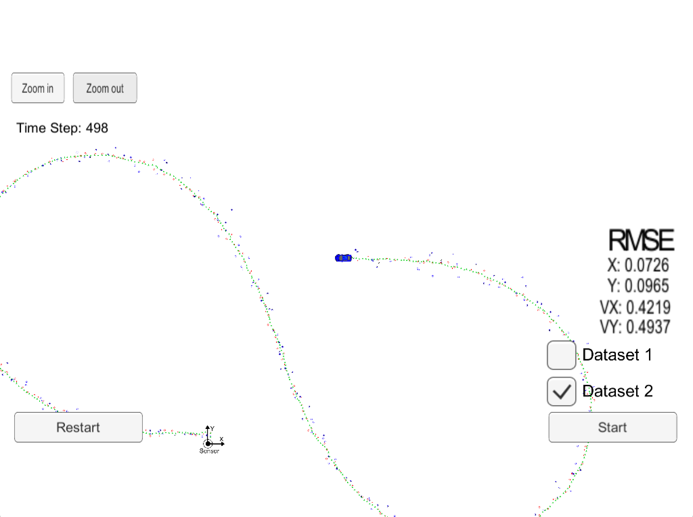

# Extended Kalman Filter Project 
Self-Driving Car Engineer Nanodegree Program

The following project will utilize a kalman filter to estimate the state of a moving object of interest with noisy lidar and radar measurements. Passing the project requires obtaining RMSE values that are lower than the tolerance outlined. 

This project involves the Term 2 Simulator which can be downloaded [here](https://github.com/udacity/self-driving-car-sim/releases).

This repository includes two files that can be used to set up and install [uWebSocketIO](https://github.com/uWebSockets/uWebSockets) for either Linux or Mac systems. For windows you can use either Docker, VMware, or even [Windows 10 Bash on Ubuntu](https://www.howtogeek.com/249966/how-to-install-and-use-the-linux-bash-shell-on-windows-10/) to install uWebSocketIO. Please see the uWebSocketIO Starter Guide page in the classroom within the EKF Project lesson for the required version and installation scripts.

Once the install for uWebSocketIO is complete, the main program can be built and run by doing the following from the project top directory.

1. mkdir build
2. cd build
3. cmake ..
4. make
5. ./ExtendedKF

#About The Project

The architecture for the construction of the Kalman Filter is based on the following flow chart.

The input data are from two sensors, LiDAR and RADAR. From the continious feed of data the kalman filter will:

1. Initialize State and Covariance Matrixes

Then Loop for:

2. Predict the next position
3. Update State based on new measurements.

In the process of performing the task, the state positions in x-y coordinate are extracted from the LiDAR and the state positions are extracted in polar form for the Radar.

As a result, we are processing:

Lidar:

1. Px: X position
2. Py: Y position

Radar:

1. RANGE: ρ (rho) the radial (shortest) distance to the obbject
2. BEARING: φ (phi) is the angle from cars straight line view
3. RADIAL VELOCITY: ρ. (rho dot) is the change in ρ

Thus we will convert to radar data to (x,y) coordinates in order to process under the same domain. This is done by using a Jacobian Matrix as shown in the source code.

The main changes were to the folowing files:

main.cpp - reads in data, runs the Kalman filter and calculates RMSE values after each measurement.
FusionEKF.cpp - initializes the filter, calls the Predict function and the Update function
kalman_filter.cpp- implementation of the Predict and Update function, for both lidar and radar.
tools.cpp - tool functions to calculate RMSE and the Jacobian matrix, used to convert polar to cartesian coordinates

#Results

The success metrics for this project are the RMSE values for 2 datasets.

The values should be less than:

| RMSE | Requirements |
|------|--------------|
| Px/Py | 0.11 |
| Vx/Vy | 0.52 |

Below will be images with markings of the predicted state and sensor data.

1. Red Markings - LIDAR DATA
2. Blue Markings - RADAR DATA
3. Green Markings - PREDICTED STATE

The following results achieved were:

### Run 1

| RMSE | Results |
|------|--------------|
| Px | 0.0973 |
| Py | 0.0855 |
| Vx | 0.4513 |
| Vy | 0.4399 |

Result: PASS

### Run 2

| RMSE | Results |
|------|--------------|
| Px | 0.0726 |
| Py | 0.0965 |
| Vx | 0.4219 |
| Vy | 0.4937 |

Result: PASS

---

## Other Important Dependencies

* cmake >= 3.5
  * All OSes: [click here for installation instructions](https://cmake.org/install/)
* make >= 4.1 (Linux, Mac), 3.81 (Windows)
  * Linux: make is installed by default on most Linux distros
  * Mac: [install Xcode command line tools to get make](https://developer.apple.com/xcode/features/)
  * Windows: [Click here for installation instructions](http://gnuwin32.sourceforge.net/packages/make.htm)
* gcc/g++ >= 5.4
  * Linux: gcc / g++ is installed by default on most Linux distros
  * Mac: same deal as make - [install Xcode command line tools](https://developer.apple.com/xcode/features/)
  * Windows: recommend using [MinGW](http://www.mingw.org/)

## Basic Build Instructions

1. Clone this repo.
2. Make a build directory: `mkdir build && cd build`
3. Compile: `cmake .. && make` 
   * On windows, you may need to run: `cmake .. -G "Unix Makefiles" && make`
4. Run it: `./ExtendedKF `

## Editor Settings

We've purposefully kept editor configuration files out of this repo in order to
keep it as simple and environment agnostic as possible. However, we recommend
using the following settings:

* indent using spaces
* set tab width to 2 spaces (keeps the matrices in source code aligned)

## Code Style

Please (do your best to) stick to [Google's C++ style guide](https://google.github.io/styleguide/cppguide.html).
